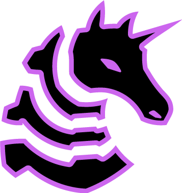

<svg xmlns="http://www.w3.org/2000/svg" width="900" height="1100" viewBox="0 0 900 1100" role="img" aria-label="GitHub Profile Summary">
  <foreignObject width="900" height="1100">
    

      

        <h1>🛡️ Certifications</h1>
        

          
          
          
          
          
          
          
        

      

      

        <h1>🥷 Experience</h1>
        

          
          
          
          
          
          
          
          
        

      

      

        <h1>🧰 Languages</h1>
        

          
          
          
          
          
          
          
          
          
        

      

      

        <h1>Things I've Built <small>(that you can't see)</small></h1>
        <ul style="line-height: 1.5; font-size: 14px; padding-left: 20px;">
          <li>Multiple fully undetected shellcode loaders with a track record of evading top-tier EDRs</li>
          <li>Custom rootkits capable of running on the latest version of Windows 11, including VBS, HVCI, and the driver blocklist</li>
          <li>A Next-Generation Command and Control framework with unique capabilities for speed and stealth</li>
          <li>Custom obfuscation tech capable of making commodity malware FUD</li>
          <li>Agentic offensive security AI</li>
          <li>Automation pipelines for common red team tasks, including payload generation, on-the-fly obfsucation, and staging</li>
          <li>Various BOFs / .NET assemblies for common operational tasks</li>
        </ul>
      

    

  </foreignObject>
</svg>
